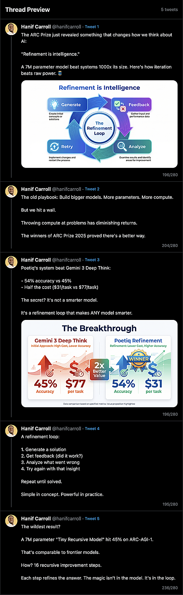

# X Thread Preview

A local tool to preview X/Twitter threads before posting. See exactly how your thread will look with real images, character counts, and X-style dark theme.




## Features

- **Live Preview**: File watcher auto-updates the preview when you edit the thread JSON
- **Real Images**: Serves images from a configurable directory
- **X-Style UI**: Dark theme matching X's actual tweet styling
- **Character Counter**: Shows count per tweet with over-limit warnings
- **Thread Connector**: Visual thread line connecting tweets

## Quick Start

```bash
# Install dependencies
bun install

# Start dev server
bun dev

# Open http://localhost:5173
```

## Usage

Create a `thread-preview.json` file (default path configurable via env):

```json
{
  "author": {
    "name": "Your Name",
    "handle": "yourhandle",
    "avatar": "/avatar.jpg"
  },
  "tweets": [
    { "text": "First tweet (the hook) 🧵", "image": "graphic-1.jpg" },
    { "text": "Second tweet with more context" },
    { "text": "Third tweet with another image", "image": "graphic-2.jpg" }
  ]
}
```

The preview updates automatically when you save the file.

## Configuration

Set these environment variables in `.env`:

```bash
# Path to your thread JSON file
THREAD_FILE_PATH="/path/to/your/thread-preview.json"

# Directory containing your images
IMAGES_BASE_PATH="/path/to/your/images"
```

## How It Works

1. **File Watcher**: Monitors your thread JSON file using chokidar
2. **SSE Updates**: Pushes changes to the browser via Server-Sent Events
3. **Image Serving**: API endpoint serves images from your configured directory

## Tech Stack

- [SvelteKit](https://kit.svelte.dev/) - Full-stack framework
- [Bun](https://bun.sh/) - JavaScript runtime & package manager
- [Tailwind CSS v4](https://tailwindcss.com/) - Styling
- [Chokidar](https://github.com/paulmillr/chokidar) - File watching

## Why?

Built to preview X threads without paying for social media scheduling tools. Write your thread in JSON, see it rendered exactly like X, iterate until it's perfect.

## License

MIT
